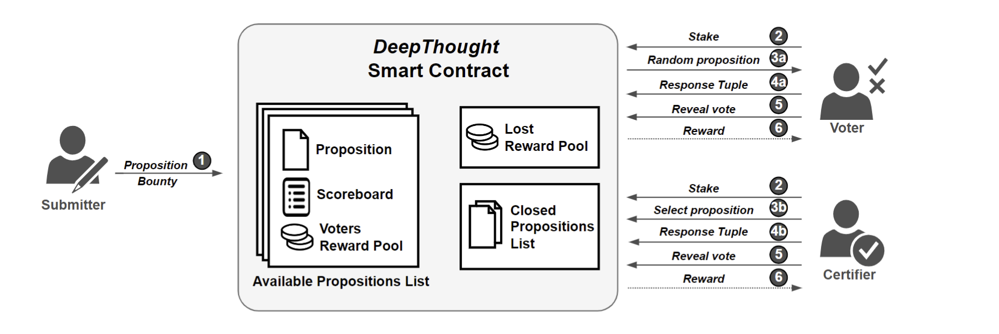

# DeepThought: a Reputation and Voting-based Blockchain Oracle

DeepThought is a distributed human-based blockchain oracle that combines voting and reputation schemes. It is in development by a team composed of me, an M.Sc. student, and two postdocs. The aim is to validate external information before storing it in a blockchain relying on humans that collaboratively cross-check external information. In particular, the first part of the development shows that our approach achieves greater resistance to voter corruption in different configurations. A full paper on this work has been accepted at the International Conference on Service Oriented Computing 2022.

## Approach



## Running Instructions

To compile:
```
truffle compile
```

To compile and deploy the contract (remember to check the address in truffle-config.js to match the Ganache one)
```
truffle migrate
```

Copy and past `truffle migrate` command output: `contract address` into the setup.py code (update the `deployed_contract_address` value).

To execute DeepThought CLI prototype (remember to check blockchain and contract addresses to match the Ganache ones)
```
python DeepThought.py
```

## Paper
You can find the paper [Here]()

